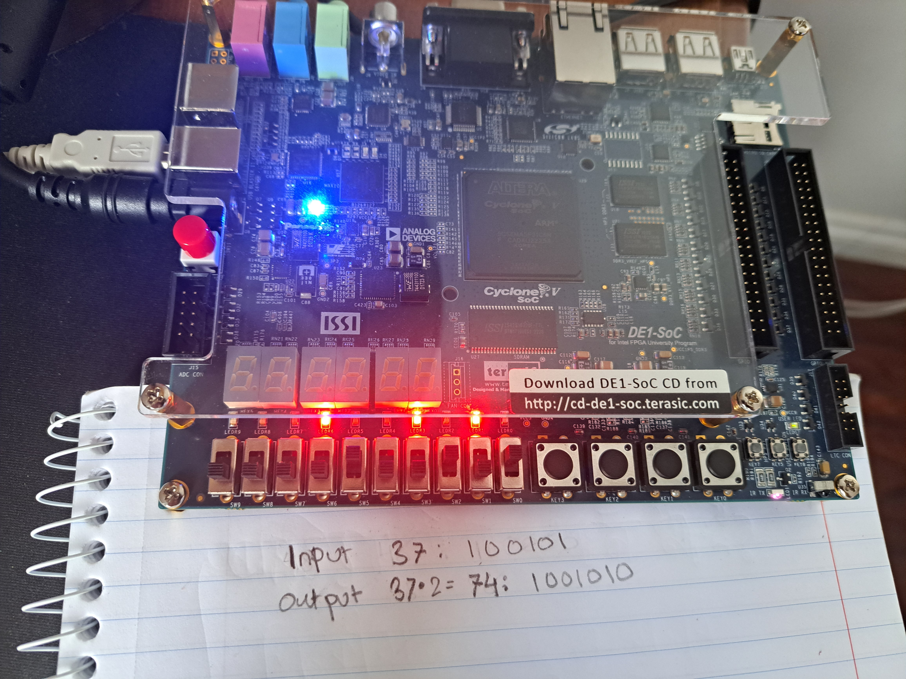
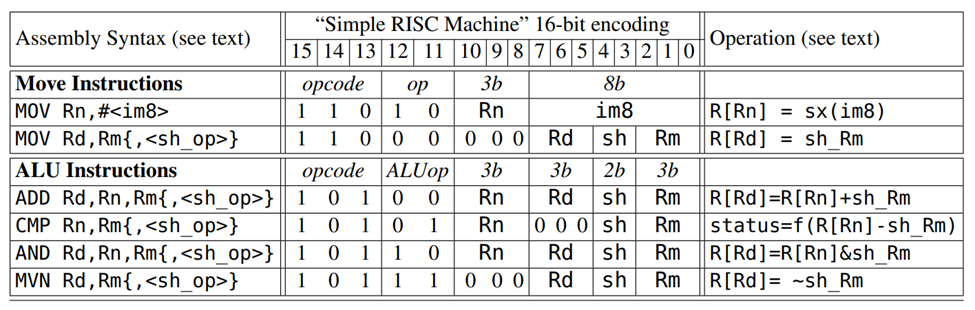
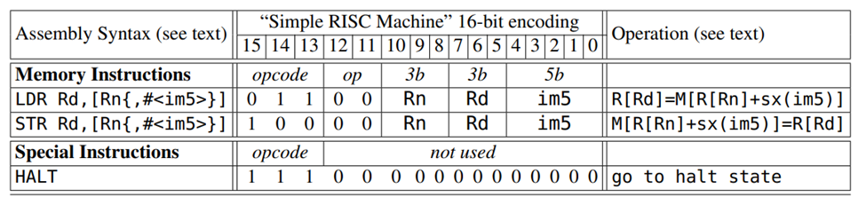

# FPGA Reduced Instruction Set Computer (RISC) Project

## Introduction

The project involves designing, building, and testing a Turing Complete 16-bit RISC machine using System Verilog on an FPGA board. Key softwares used include Quartus and Questa/ModelSim.

## Project Features

- **RISC Processor Design:** Implements a simple RISC processor architecture.
- **SystemVerilog Implementation:** Written in SystemVerilog hardware description language.
- **Simulation and Testing:** Includes testbenches for thorough verification of the processor via Questa/ModelSim.
- **FPGA Deployment:** Configured to run on an FPGA development board (DE1-Soc).

## Supported Instructions

The processor can execute a variety of ARM instructions. The following diagram illustrates the ARM instruction encodings that the machine can run:

## Hardware Components

- **FPGA Board:** DE1-SoC development board
- **Processor Design:** Custom RISC processor implemented in SystemVerilog
- **Memory:** On-chip memory for instruction and data storage

## Software Description

### SystemVerilog Code

Utilizing modularization, the processor is designed in SystemVerilog and includes several modules for different components of the processor. The main design files are:

- `RISC_top.sv`: Top-level module for the RISC processor
- `cpu.sv`: Central Processing Unit module
- `datapath.sv`: Datapath module
- `alu.sv`: Arithmetic Logic Unit module
- `instruction_decoder.sv`: Instruction Decoder module
- `finite_state_machine.sv`: Finite State Machine module
- `regfile.sv`: Register File module
- `shifter.sv`: Shifter module

### Testbenches
- `cpu_tb.sv`: Testbench for the CPU
- `datapath_tb.sv`: Testbench for the datapath
- `RISC_top_tb.sv`: Testbench for the top-level module
- `RISC_check.sv`: Verification module

## Project Demonstration

- A video demonstration of the RISC processor in action voiced by my partner Afeef can be found linked here: https://youtu.be/biTuX5kdb8c

## Future Improvements

- Enhance the processor design to support more complex instructions.
- Implement pipelining for improved performance.
- Expand the testbench coverage to include more edge cases and scenarios.
