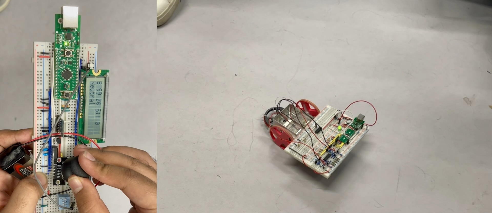

## Introduction

This project involves designing, building, programming, and testing a battery-powered remote-controlled robot that can detect metal using two different microcontroller systems.

## Project Features

- **Two Microcontroller Systems:** Utilizes EFM8LB12 and STM32L051 microcontrollers from different families to control the remote and the robot, respectively.
- **Battery Operated:** Both the robot and the controller are powered by batteries, making the system fully mobile.
- **Remote Operation:** Controlled via a remote that displays metal detection strength and includes a buzzer that beeps at frequencies corresponding to the metal strength detected.
- **Metal Detection:** Includes a metal detector capable of detecting various metals and their strengths using a Colpitts oscillator configuration.
- **Autonomous Capabilities:** Features an 'autonomous driving' mode where the robot can navigate predefined paths without manual control.

## Hardware Components

- **Robot:**
  - STM32L051 microcontroller
  - JDY40 Radio
  - Motors, wheels, and chassis
  - Various sensors and actuators

- **Remote:**
  - EFM8LB12 microcontroller
  - JDY40 Radio
  - LCD display
  - Joystick for navigation

## Software Description

The robot and remote are programmed in C. The software includes functionality for:
- Remote control of the robot's movement
- Real-time display of metal detection results
- Autonomous navigation based on pre-set conditions

## Demonstration

- Here is a video showcasing the remote controlled metal detector robot in action: https://youtu.be/IKOVHH1TC6M

## Future Improvements

- Enhance metal detection sensitivity and range.
- Implement machine learning algorithms to improve autonomous navigation capabilities.
- Upgrade the communication protocol for increased range and reliability.